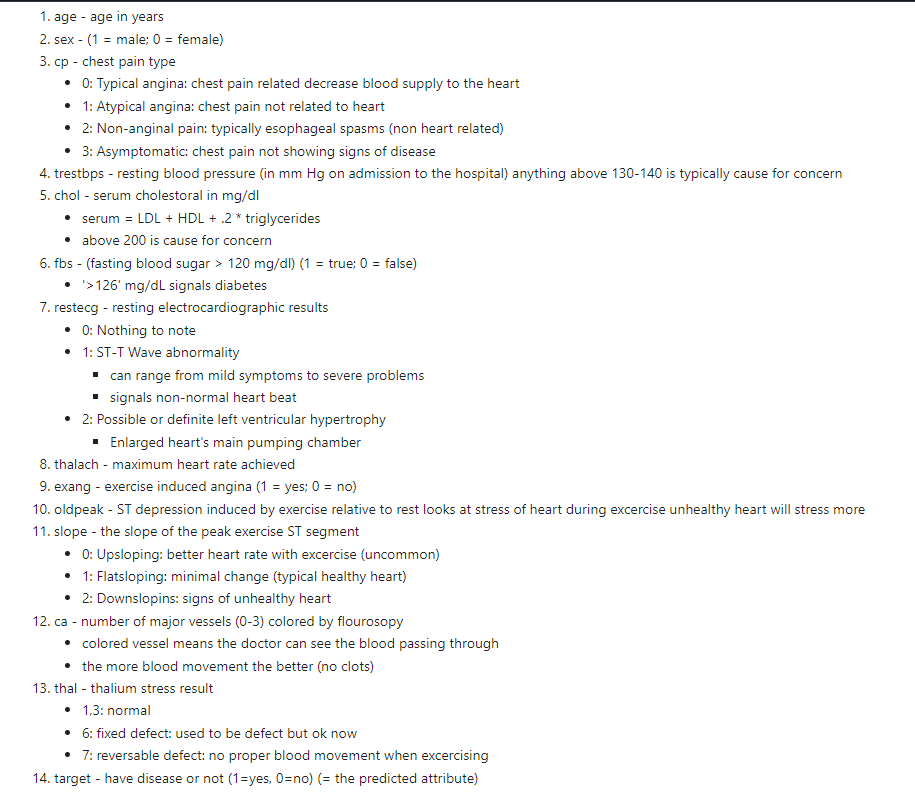

# Classification-Problem

In this project, we created a model that can predict whether patients have heart disease based on their clinical parameters. We utilized the following libraries:

* Numpy
* Pandas
* Matplotlib
* Seaborn
* Sklearn

Clinical parameters:

